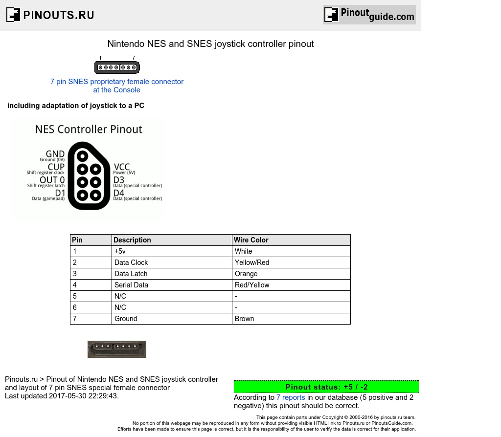
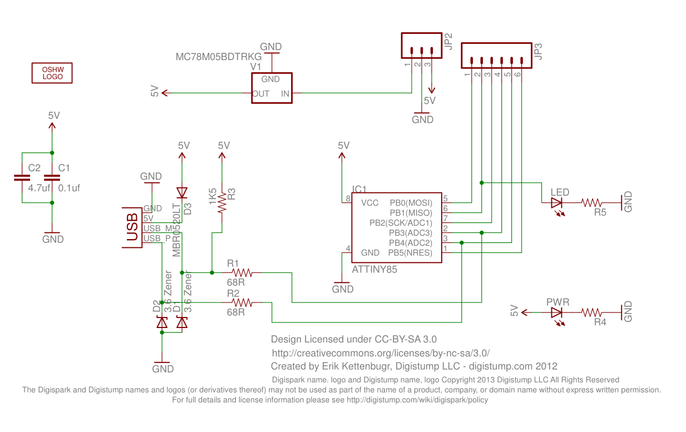

# Hardware
It is [DigiSpark board](http://digistump.com/wiki/digispark) with soldered NES/SNES controller connector.

DigiSpark pin | ATtiny pin  | Controller pin
--------------|-------------|---------------
  VCC         | VCC / pin 8 | VCC / pin 1
  GND         | GND / pin 4 | GND / pin 7
  P0          | PB0 / pin 5 | CLOCK / pin 2
  P1          | PB1 / pin 6 | LATCH / pin 3
  P2          | PB2 / pin 7 | DATA / pin 4

This is defined in [firmware/serial_pad.c](../firmware/serial_pad.c)

## Controller pinout

## DigiSpark schematic

If you are going to build one yourself, V1 regulator is not needed - we are powered by the USB port.
 
Also you probably dont wan't to have LEDs blinking from your adapter.
